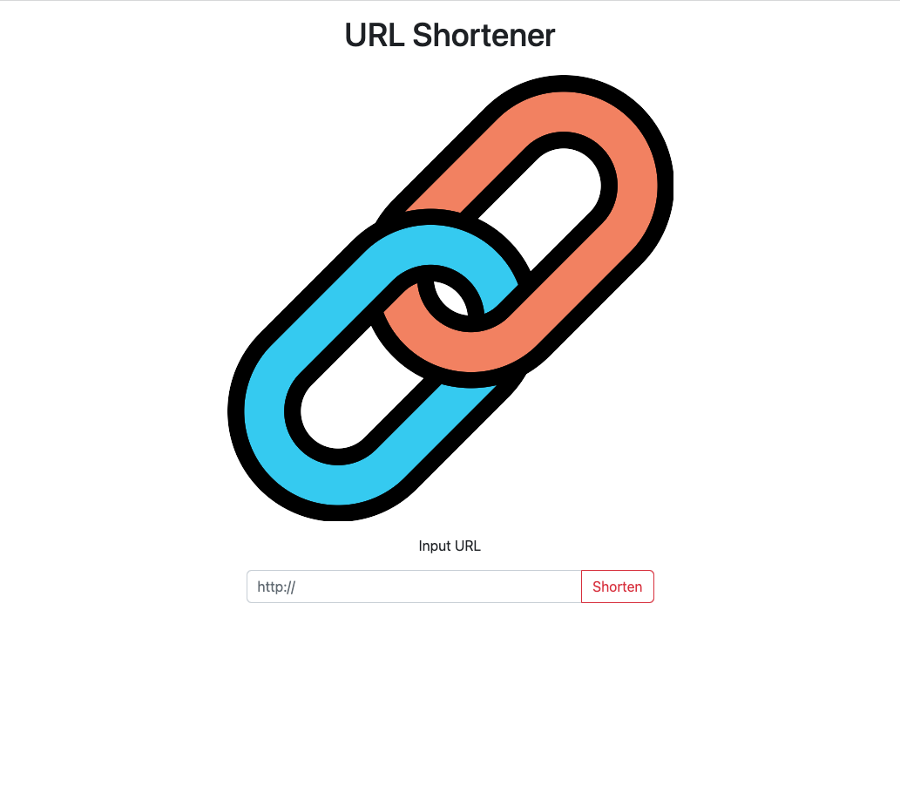

# Url-Shortener




## 介紹

一個短網址產生器。

## 功能

- 產生短網址
- 相同網址產生同一組短網址
- 一鍵複製產生後的短網址

## 開始使用

1. 請先確認有安裝 node.js 與 npm，套件版本詳見下方[開發工具](#開發工具)
2. 將專案 clone 到本地
   ```bash
   git clone https://github.com/RayYangTW/url-shortener.git
   ```
3. 設定 MongoDB，打開資料夾建立.env 檔案並設定以下字串

   ```
   MONGODB_URI=mongodb+srv://<你的 MongoDB 帳號>:<你的 MongoDB 密碼>@cluster0.xxxx.xxxx.net/<你的 MongoDB 資料庫名稱><?retryWrites=true&w=majority
   ```

4. 在本地開啟之後，透過終端機進入資料夾，輸入：

   ```bash
   npm install
   ```

5. 安裝完畢後，繼續輸入：

   ```bash
   npm run start
   ```

6. 若看見此行訊息則代表順利運行，打開瀏覽器進入到以下網址

   ```bash
   This app is running on http://localhost:3000
   ```

7. 若欲暫停使用

   ```bash
   ctrl + c
   ```

## 開發工具

- Node.js@16.18.0
- Express@4.18.2
- Express-Handlebars@3.0.0
- Bootstrap@5.2.2
- Font-awesome
- MongoDB
- Mongoose@6.7.2
- dotenv@16.0.3
